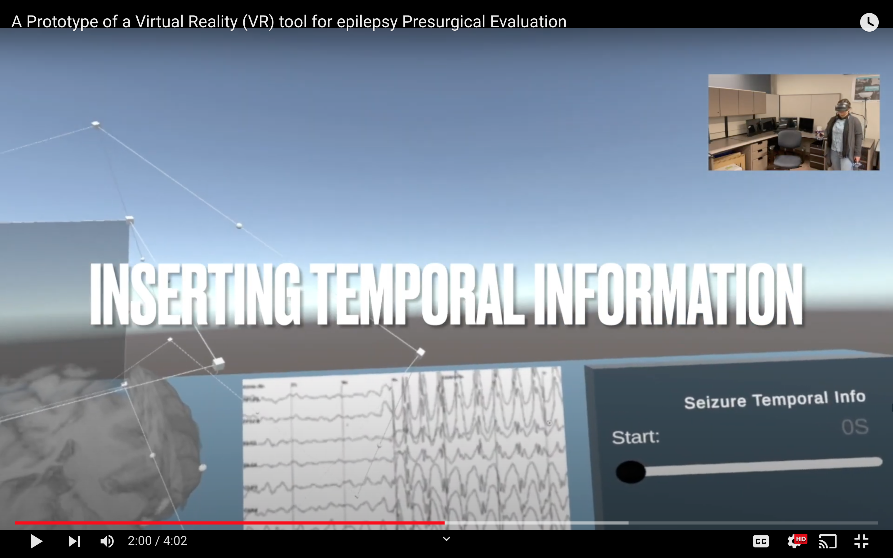
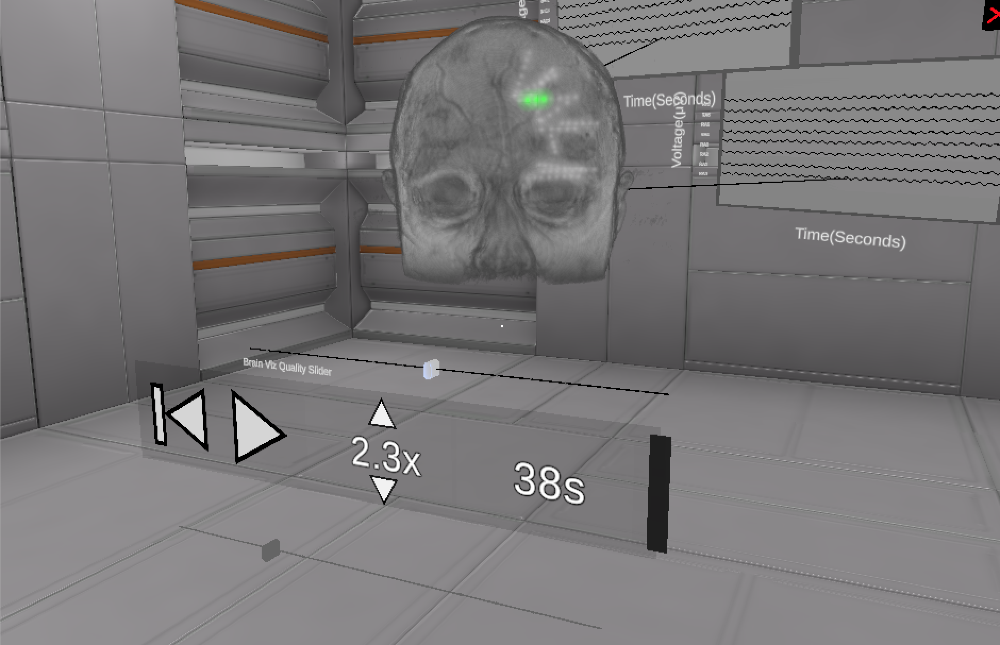
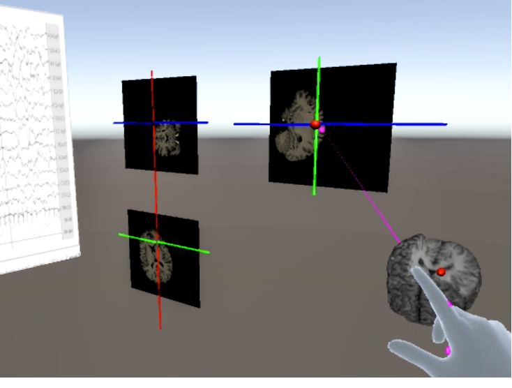
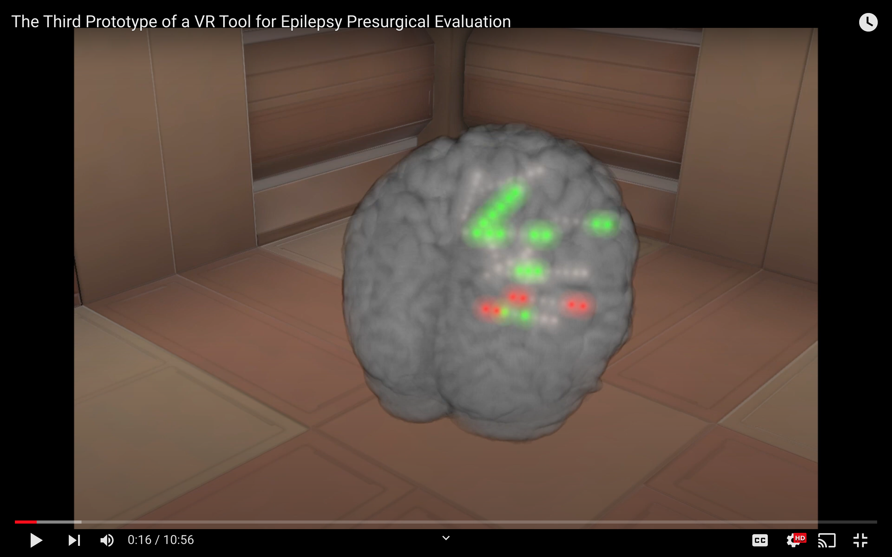
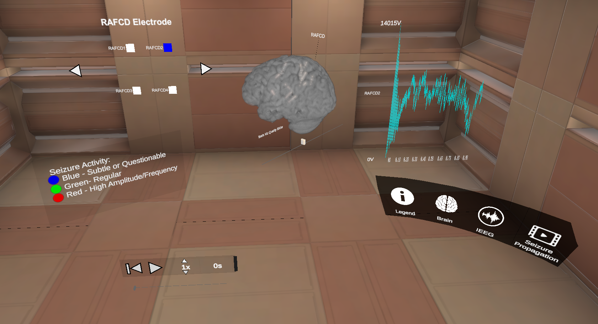
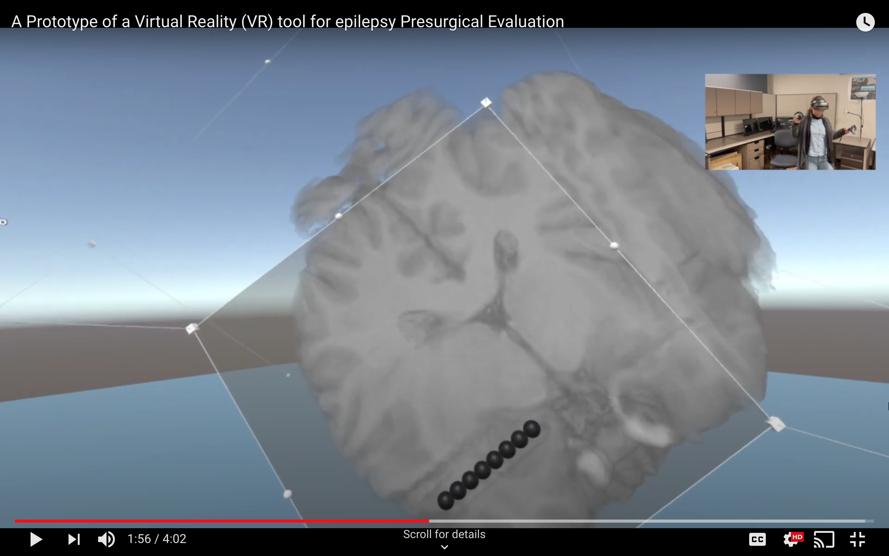
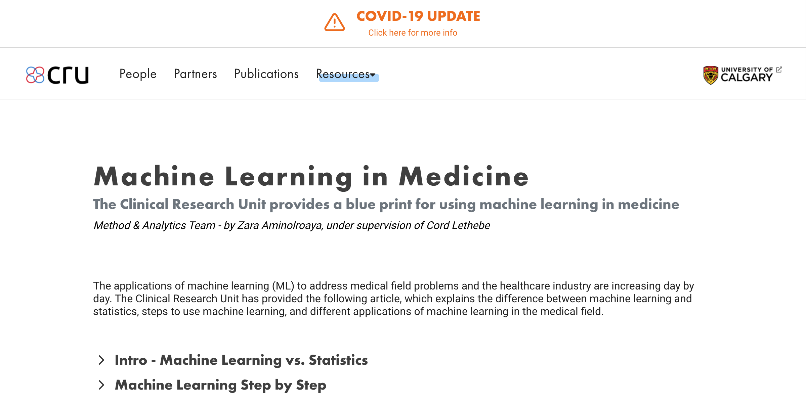
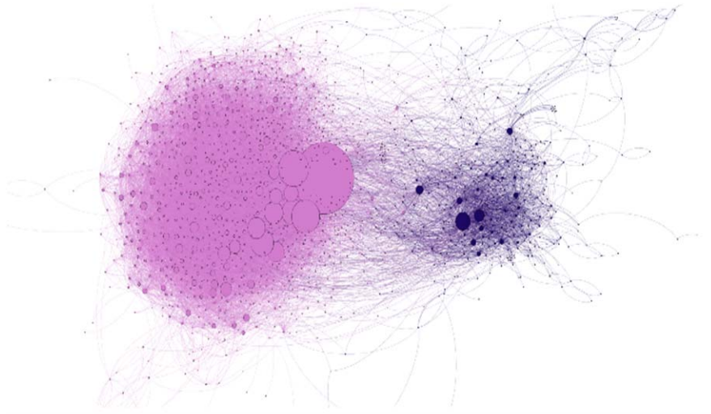

<h1>About me</h1>

<h1>Publications</h1>

### Papers (VR/HCI)

| ACM AVI 2022 Watch The Videos Whenever You Have Time: Asynchronously Involving Neurologists In VR Prototyping <i><b>Zahra Aminolroaya</b>, Wesley Willett, Colin B. Josephson, Samuel Wiebe, and Frank Maurer</i> <kbd>pdf</kbd><kbd>video</kbd>     |  |

| ACM ISS 2020 Virtual Reality for Understanding Multidimensional Spatiotemporal Phenomena in Neuroscience <i><i><b>Zahra Aminolroaya</b>, Seher Dawar, Samuel Wiebe, Colin B. Josephson, and Frank Maurer</i> <kbd>pdf</kbd><kbd>video</kbd>     |  |

  

          <u>ACM AVI 2022</u>
          
Watch The Videos Whenever You Have Time: Asynchronously Involving Neurologists In VR Prototyping

          <i><b>Zahra Aminolroaya</b>, Wesley Willett, Colin B. Josephson, Samuel Wiebe, and Frank Maurer</i>
          <kbd>pdf</kbd>
          <kbd>video</kbd>
  

   
  

          
  

* * *

  

          <u>ACM ISS 2020</u>
          
Virtual Reality for Understanding Multidimensional Spatiotemporal Phenomena in Neuroscience

          <i><b>Zahra Aminolroaya</b>, Seher Dawar, Samuel Wiebe, Colin B. Josephson, and Frank Maurer</i>
          <kbd>pdf</kbd>
          <kbd>video</kbd>
  

  

          
  

  

          <u>ACM ISS 2019</u>
          
EPES: Seizure Propagation Analysis in an Immersive Environment/div>
          <i><b>Zahra Aminolroaya</b>, Samuel Wiebe, Colin Bruce Josephson, Hannah Sloan, Christian Roatis, Patrick Abou Gharib, Frank Maurer, and Kun Feng</i>
          <kbd>pdf</kbd>
          <kbd>video</kbd>
  

  

          
  

* * *
## Projects
[VR in Neuroscience](/sample_page)
 

[Data Analysis in the Clinical Research Unit](/pdf/sample_presentation.pdf)
 

[Social Network Analysis](/pdf/sample_presentation.pdf)
 

[Plagarism Detection](/pdf/sample_presentation.pdf)
 

